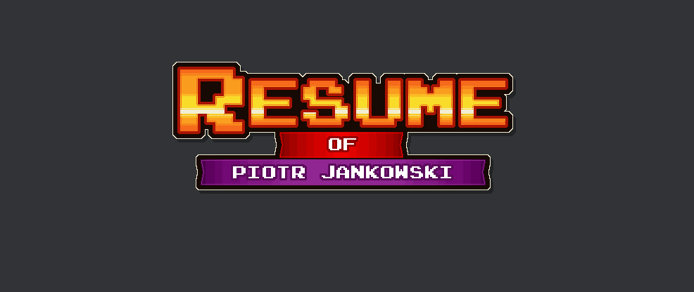

# What's this?
It's my personal interactive resume project developed with ReactJS and tiny bit of Redux. Includes build and watch processes based on Webpack.

Live version is available at http://jankowskiresume.com.

## Available run scripts
Remember to first install required node dependencies through `npm install`.

Just type `npm run <taskNameHere>`. Tasks list:

- watch - build project in development mode and initializes change watcher,
- build - build project for development purposes,
- build-prod - build project with production settings, including minification and similar,
- test - run karma to process all available tests.

## Todo

- add missing tests to PageContext and CarPicker,
- attach Travis,
- add people animation.

## License

Code is licensed under MIT License

All .png files are licensed under [CC BY 3.0](https://creativecommons.org/licenses/by/3.0/)
